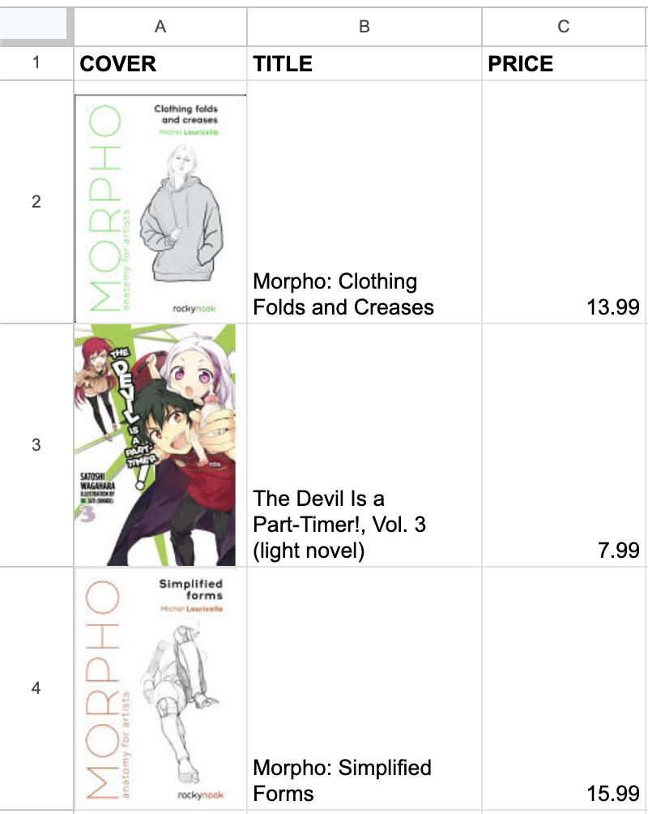

# Book_Logger
## About
A simple project to decode ISBN barcode of Books and log the book information into a Google Sheet. I own a lot of books that I would like to keep track of in a Google Sheet. 
Basic Information collected are:
- Cover Image
- Book Title
- Book Price
  
## Technoloy used
- Python
- Opencv-Python
- Gspread (high-level API)
- Google Books API

Example of book logged into Google Sheet:

## Inital Project Process
To handle this project, I used Opencv's BarcodeScanner class to detect and decode book's ISBN barcode. I also tried to use pytesseract to read the price of the book that is near the ISBN barcode. unfortunately, pytesseract can not always read the price tag of the book accurately. So I decided to scale down and just use the Google Books's API that contains the price of the book. The only issue of using Google Book's API is that the price is only for e-books, not physical format. 

After getting the information from the Google Books API, I used Google Cloud to activate the Google Sheets API. Next, I needed to access my worksheet and start adding data information from the API. 

## Resources Used
**Google Sheets API w/Python**: https://www.youtube.com/watch?v=zCEJurLGFRk&t=1269s
**OpenCV Barcode**: https://docs.opencv.org/4.x/d6/d25/tutorial_barcode_detect_and_decode.html

